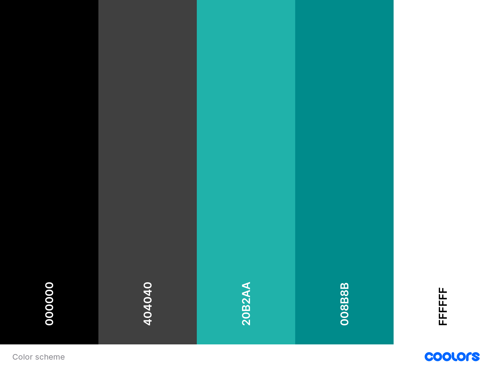

# |Finance App- Snappy Savings
​
## Team Name: Django Unchained
​
[Link to Deployed Project](<<add_deployed_link_to_project_here>>)
​
## Contents
​
* [User Experience (UX)](#user-experience)
  * [User Stories](#user-stories)
* [Technology](#technology)
* [Design](#design)
  * [Color Scheme](#color-scheme)
  * [Typography](#typography)
  * [Imagery](#imagery)
  * [Wireframes](#wireframes)
* [Deployment & Usage](#deployment)
* [Testing](#testing)
* [Credits](#credits)
  * [Code](#code)
  * [Content](#content)
  * [Media](#media)
  * [Acknowledgements](#acknowledgements)
​
## User Experience 
  - Easily navigate and use the website.
  - Create an account to track spending and if they can afford a purchase
  - Input their savings and what they want to buy
  - Recieve a quirky message on whether they can afford the purchase or not
​
### User stories

As a user of the app I want:
- The ability to have a password protected login, so that my financial information is safe. 
- The abiity to track my spending habits, so I can manage my finances.
- To be motivated to not make purchases I cannot afford.

End user goal: 
- Login using a username and password.
- <!-- Use an API?--> See a display of recent transactions.
- Recieve messages from the app when inputting something I can or cannot afford.

End business goal: 
- Increase app usage. Acceptance criteria: Allow user to create a profile with confirmation of password, allowing a user to login securely. Measurement of success: 
- Improve customer satisfaction. Acceptance criteria: Allow user to see recent transactions and merchant catagories using an <!-- API?-->. Measurement of success:
- Make the app fun and increase customer retention. Acceptance criteria: When a user inputs something they can or cannot afford based upon their savings, they will recieve a 
related message. Measurement of success:
​
## Technology

- This website has been written using HTML, CSS, JAVASCRIPT, PYTHON, BOOTSTRAP, DJANGO

### Frameworks, Libraries and Programs Used
- Github: Storing and hosting my code/repository
- Gitpod: Code editor for writing my code and storing other images/files
- Font Awesome: For icons used in the site
- Coolors: For choosing the palette to be used in the website
- Google Fonts: To import the fonts used throughout the site
- Google DevTools: Used throughout the site's creation to test responsiveness and adjust layout
- Balsamiq: Wireframe software
- Am I Responsive: To create a visual of the website across different device sizes 
- [Pexels](https://www.pexels.com/) For images used in the website
- [YouTube](https://www.youtube.com/) For inspiration and coding tutorials
- [W3schools](https://www.w3schools.com/) For coding questions and reference
- [Freecodecamp](https://www.freecodecamp.org/) For coding questions and reference
- [Lighthouse](https://developers.google.com/web) To test performance of website
- [Pair fonts](https://pairfonts.com/) To visualize font pairing

​
## Initial MVP idea:
​
 We initially thought about what could set our application apart from other finance apps, and we came up with the idea of producing motivational and funny messages based on whether the user can afford a purchase or not. We then discussed which API we would use and how this would allow the user to track spending. We started to concider the layout of the different pages of the application and decided, based upon early wireframes, that we would have a seperate page for returing users to login as well as for new users to create an account. We decided on an initial color scheme and elements of different pages and discussed how we would implement them 

<< consider talking about how you planned as a team here and what tools were implemented >>
​
### Actual idea & content:
​
<< how does you final product/project match up to your initial mvp plans >>
​
<< detail idea / features / functionality here >>
​
## Design
​
### Color Scheme:

This website uses a palette of subtle colours that are simple yet eye catching to attract and keep users in the website. 
This palette was created using [Coolors](https://coolors.co/000000-404040-20b2aa-008b8b-ffffff) website

​
### Typography:

[Google Fonts](https://fonts.google.com/) was used to source the font styles used throughout the website:
- Montserrat was used throughout the website. 
- It promotes readability and maintains a clean design.

​
### Imagery:
- Most images were sourced from google
[Google Images](https://images.google.com/)
​
## Wireframes

Wireframes were created using [Balsamiq Wireframing Software](https:/balsamiq.com/)

View wireframes [PDF file here](https://github.com/MiaRasmussen05/Hackathon-Jan-23/blob/main/documentation/snappy-savings.pdf)
​
<< consider adding some notes to detail the planned components or functionality >>
​

## Deployment
<< detail deployment methods used here, and any extraneous circumstances to run the project locally >>

​
## Testing

### HTML
 [W3C Markup Validator](https://validator.w3.org/nu/) - validation service used. 

Homepage

login

register

profile

 

### CSS

 [W3C CSS Validator](https://jigsaw.w3.org/css-validator/#validate_by_address)  - validation service used. 

 

Stylesheet

​
## Credits

​
### Content
<< any content, such as facts/references/text that isn't yours...must go here >>
​
### Media
<< you may have already done this above in the Imagery section, but just in case, please attribute Media acquisition here >>
​
### Acknowledgements
<< personal thanks and praise 🙌 >>